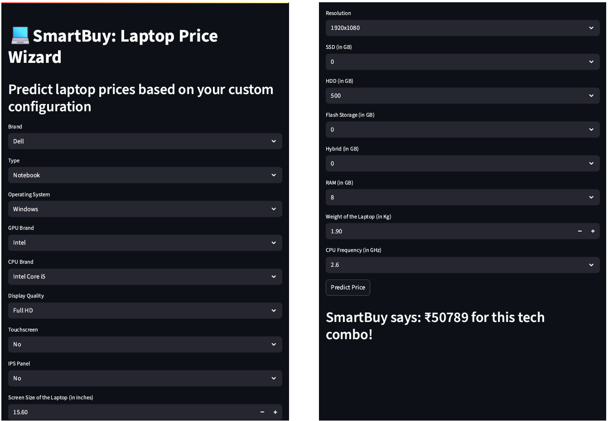

# 📊 SmartBuy: Predictive Analytics for Laptop Prices
An AI-powered tool for analyzing and predicting laptop prices using machine learning.

---
## 🧠 Project Overview
SmartBuy is a machine learning-powered solution designed to predict laptop prices based on key specifications. It helps consumers make informed purchasing decisions and enables businesses to optimize pricing strategies, manage inventory, and benchmark against competitors.

---
## 🎯 Objectives
- Build a predictive model to estimate laptop prices using ML algorithms.
- Identify key features influencing laptop pricing (e.g., RAM, storage, brand, display).
- Provide accurate price recommendations for consumers and retailers.
- Enable competitive analysis and inventory forecasting.

---
## 📁 Dataset Overview
- Total Entries: **1303** laptops
- Features: **12** raw features including brand, specs, and price
- Target Variable: **Price** (in INR)

#### 🗂️ Data Description

| **Feature Name**     | **Type**     | **Description**                                                                 | **Example Values**                      |
|----------------------|--------------|----------------------------------------------------------------------------------|-----------------------------------------|
| `Unnamed: 0`         | Numerical    | Index column from the original CSV (not meaningful)                             | 0, 1, 2, ...                             |
| `Company`            | Categorical  | Brand of the laptop                                                             | Dell, Apple, Lenovo                     |
| `Product`            | Categorical  | Specific product model name                                                     | Inspiron 15, MacBook Air, ThinkPad X1   |
| `TypeName`           | Categorical  | Category of laptop (Notebook, Gaming, Ultrabook, etc.)                          | Notebook, Gaming, Ultrabook             |
| `Inches`             | Numerical    | Screen size in inches                                                           | 13.3, 15.6, 17.3                         |
| `ScreenResolution`   | Categorical  | Full screen resolution string                                                   | 1920x1080, 1366x768, 3200x1800          |
| `Cpu`                | Categorical  | Full CPU description including brand and model                                  | Intel Core i5 7200U, AMD A9-9420        |
| `Ram`                | Categorical  | RAM size in GB (with unit as string)                                            | 8GB, 4GB, 16GB                           |
| `Memory`             | Categorical  | Storage configuration (can include multiple types)                              | 256GB SSD, 1TB HDD, 128GB SSD + 1TB HDD |
| `Gpu`                | Categorical  | Full GPU description including brand and model                                  | Intel HD Graphics 620, Nvidia GTX 1050  |
| `OpSys`              | Categorical  | Operating system installed                                                      | Windows 10, macOS, No OS, Linux         |
| `Weight`             | Categorical  | Weight of the laptop (with unit as string)                                      | 2.1kg, 1.37kg                            |
| `Price`              | Numerical    | Selling price of the laptop in Indian Rupees                                    | 39990, 62990, 84990 

**Key Features**:
- **`Company`**, **`TypeName`**, **`OS`**, **`CPU`**, **`GPU`**, **`RAM`**, **`Memory`**, **`ScreenResolution`**, **`Weight`**, **`Price`**

---
## 📂 Folder Structure
``` tree
smartbuy-predictive-analytics-laptop-prices/
│
├── 📁 data/
│   ├── 📁 original/                                            # Original dataset             
|       ├── laptop_data.csv
│   └── 📁 processed/                                           # Cleaned and transformed data
│       ├── df.csv
|       ├── df.joblib
|
├── 📁 models/
│   ├── model.joblib                                            # Trained ML model
│   └── preprocessor.joblib                                     # Fitted preprocessing pipeline
│
├── 📁 notebooks/
│   ├── smartbuy_predictive_analytics_for_laptop_prices.ipynb   # Notebook
│   ├── hyperparameter_tuning.ipynb         
│              
├── 📁 app/
│   └── streamlit_app.py                                        # Streamlit UI logic
│
├── 📁 images/
│   └── sample_prediction_output.png                            # App demo screenshot
│
├── requirements.txt                                            # Python dependencies
├── README.md                                                   # Project overview and documentation
├── LICENSE
└── .gitignore
```
---
## 🧹 Data Cleaning & Feature Engineering
- Removed irrelevant columns (**`Unnamed: 0`**, **`inches`**, **`retina_display`**)
- Extracted new features:
  - **`cpu_model`**, **`cpu_freq`**, **`gpu_company`**, **`os`**
  - **`screen_type`**, **`touchscreen`**, **`ips_panel`**, **`ppi`**
  - **`ssd`**, **`hdd`**, **`flash_storage`**, **`hybrid`**
- Handled outliers using IQR capping
- Applied log transformation to normalize skewed price distribution

#### 🔄 Raw to Engineered Feature Mapping

| **Raw Feature**        | **Transformed Feature(s)**           | **Transformation Description**                                                                 |
|------------------------|--------------------------------------|--------------------------------------------------------------------------------------------------|
| `Unnamed: 0`           | -                                    | Dropped - index column with no predictive value                                                  |
| `Company`              | `company`                            | Renamed and retained as categorical feature                                                      |
| `Product`              | -                                    | Dropped - too granular, not useful for generalization                                            |
| `TypeName`             | `type_name`                          | Renamed and retained as categorical feature                                                      |
| `Inches`               | -                                    | Dropped - used to compute `ppi`                                                                  |
| `ScreenResolution`     | `screen_type`, `ppi`, `touchscreen`, `ips_panel` | Parsed to extract resolution, screen quality, and flags for IPS/touchscreen                     |
| `Cpu`                  | `cpu_model`, `cpu_freq`              | Parsed to extract CPU brand/model and frequency                                                  |
| `Ram`                  | `ram`                                | Converted from string (e.g., "8GB") to integer                                                   |
| `Memory`               | `ssd`, `hdd`, `flash_storage`, `hybrid` | Decomposed into separate storage types using regex and logic                                     |
| `Gpu`                  | `gpu_company`                        | Extracted GPU brand (Intel, Nvidia, AMD, ARM)                                                    |
| `OpSys`                | `os`                                 | Renamed and grouped into categories (Windows, Mac, Other/Linux/No OS)                           |
| `Weight`               | `weight`                             | Converted from string (e.g., "2.1kg") to float                                                   |
| `Price`                | `price`                              | Log-transformed to reduce skewness and improve model performance                                |

---
## 📊 Exploratory Data Analysis
- Univariate, bivariate, and multivariate analysis performed
- **`Key insights`**:
    - **`RAM`**, **`SSD`**, **`PPI`**, and **`CPU frequency`** are strong predictors of price
    - Brands like **`Razer`**, **`LG`**, and **`Apple`** command premium pricing
    - **`Touchscreen`** and **`IPS panels`** increase laptop cost

### 🔍 Feature Selection & Correlation
- Top correlated features with price:
    - **`ram (0.68)`**, **`ssd (0.66)`**, **`ppi (0.53)`**, **`cpu_freq (0.50)`**
- Feature importance analysis confirms these as top contributor

---
## 🏗️ Model Development
Algorithms Used:
- Linear Regression
- Decision Tree
- Random Forest
- KNN
- SVM
- Gradient Boosting
- XGBoost
  
Evaluation Metrics:
- R² Score
- Mean Absolute Error (MAE)
- Cross-validation with K-Fold (n=5)

---
## 🏆 Final Model: Gradient Boosting Regressor
- **`R² Score`**: **`0.9066`**
- **`MAE`**: **`0.1349`**
- Best generalization across validation and test sets
- Handles non-linear relationships effectivel

---
## 🔧 Model Deployment
- Final artifacts exported using joblib:
    - **`model.joblib`**: Trained Gradient Boosting model
    - **`preprocessor.joblib`**: ColumnTransformer for preprocessing
    - **`df.joblib`**: Final cleaned dataset

---
## 🧪 Sample Prediction

**Query:** Dell, Notebook, Windows, Intel Core i5, Full HD, 8GB RAM, 500GB HDD, 1.9Kg, 2.6GHz CPU Frequency

**Actual Price:** ₹49,818  

**Predicted Prices:**
- XGBoost: ₹47,355  
- Random Forest: ₹52,042  
- Gradient Boost: ₹50,789  

📸 Below is a screenshot of the app’s prediction output for this query:


*Streamlit dashboard showing model predictions and comparison with actual price*

🔗 **Try it yourself:**  
Explore predictions for any laptop configuration using the live app:  
👉 [Launch "SmartBuy: Laptop Price Wizard"](https://smartbuy-laptop-scout.streamlit.app/)

---
## 📌 Key Takeaways
The Gradient Boosting Regressor demonstrated strong predictive performance for laptop price estimation, achieving an R2 score of 0.9066 and a Mean Absolute Error (MAE) of 0.1349. These metrics indicate that the model successfully captures key patterns in the data, leading to accurate price predictions.

- High Accuracy (R2 Score = 0.9066) --> The model explains 90.66% of the price variance, making it a reliable predictor.
- Low Error (MAE = 0.1349) --> Predictions are close to actual values, minimizing deviation.
- Gradient Boosting's Strengths --> Handles nonlinear relationships effectively, leading to superior generalization.

---
## Critical Factors
- **RAM**, **PPI** (**Screen Size** and **Resolution**), **Storage Type**, **CPU Company, Model & Frequency**, **Weight** and **Type** of laptops are among the **top 5** important features contributing significantly in deciding the price of the laptop.
- **RAM** & **Storage Type**: Larger RAM and SSDs usually increase price more than HDDs.
- **Screen Size** and **Resolution**: Higher resolution and large screens contribute to pricing
- **Processor Type** and **Speed**: High-performance processors (e.g., Intel Core i7) significantly impact cost.
- **Brand Premiums**: Some brands may have higher baseline pricing, impacting predictions.

---
## ✅ Conclusion
SmartBuy successfully leverages predictive analytics to enhance laptop price estimation, ensuring informed decisions for both consumers and businesses. By utilizing machine learning models such as Gradient Boosting, Random Forest, and XGBoost, the system achieves high accuracy in price predictions based on key specifications like RAM, storage, display quality, processor type and brand.

### Key Outcomes
- Improved Pricing Accuracy --> Helps buyers and sellers make data-driven decisions.
- Optimized Inventory Management --> Retailers can adjust stock based on pricing trends.
- Competitive Market Insights --> Businesses can benchmark prices against competitors.
- Enhanced Consumer Experience --> Consumers receive fair pricing recommendations tailored to their needs.

---
## 🚀 Future Enhancements
- Real-time market adjustments based on demand
- Feature expansion: battery life, build quality, warranty, etc.
- Integration with e-commerce platforms for dynamic pricing

---
## 👨‍💻 Author & Contact
**Aniket Muthal**

Let’s connect and advance strategic machine learning together 🚀

- 📧 Email: [aniketmuthal4@gmail.com]
- 🔗 LinkedIn: [https://www.linkedin.com/in/aniket-muthal]
---